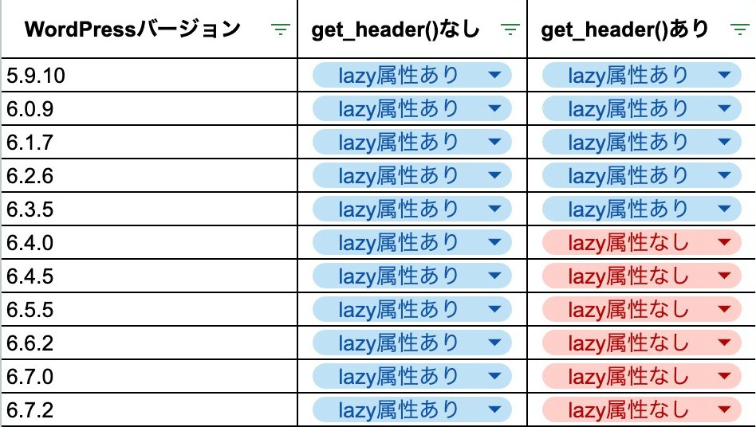

> [!NOTE]
> 本件は以下記事にて調査・まとめを行いました。
> <https://cofus.blog/posts/wordpress-6-4-get-header-prevents-lazy-loading>

---

WordPress のテーマにて、`get_header()`の有無で`the_content()`より出力される img タグに`loading="lazy"`が付与されたり・されなかったりする挙動が見られるようですが、これは仕様でしょうか？

Ver 6.3.5 までは`get_header()`の有無で挙動は変わらないようですが、Ver 6.4 系以降`get_header()`があると loading 属性付与されないようでした。
仕様でしたらこの辺りのドキュメントを探しておりますので、ご存知の方がいらっしゃいましたら教えていただけますと幸いです。

以下は挙動確認をまとめた表です。

<kbd>
  
</kbd>

スプレッドシート: <https://docs.google.com/spreadsheets/d/15ukqzNhDGkvGtlx2HPSTdO4LIqMnPcoCfwQ3pYPOGXc/edit?usp=sharing>

## 確認に用いたコード

```php
<?php
/**
 * @since 1.0.0
 * @package test-theme
 */

?>

<!DOCTYPE html>
<html lang="ja">
  <head>
    <?php wp_head(); ?>
  </head>

  <body>
    <main>
      <?php
      get_header(); // NOTE: ここの有無でloading属性が付与されたり・されなかったりする
      the_content();
      ?>
    </main>
    <?php wp_footer(); ?>
  </body>
</html>
```

詳細は`./test-theme`配下、及び`./test-theme/single.php`をご参照ください。

## 確認環境

### Ver 6.3.5

#### `get_header()`あり（loading 属性あり）

- <https://sweet-router.localsite.io/hello-world>
- `amusement` / `loving`

#### `get_header()`なし（loading 属性あり）

- <https://innate-sunrise.localsite.io/hello-world>
- `recipe` / `flashy`

### Ver 6.4.0（以降すべて同様の挙動のようです）

#### `get_header()`あり（loading 属性なし）

- <https://cuddly-spiral.localsite.io/hello-world>
- `parachute` / `general`

#### `get_header()`なし（loading 属性あり）

- <https://panicky-mine.localsite.io/hello-world>
- `jewelry` / `noiseless`
